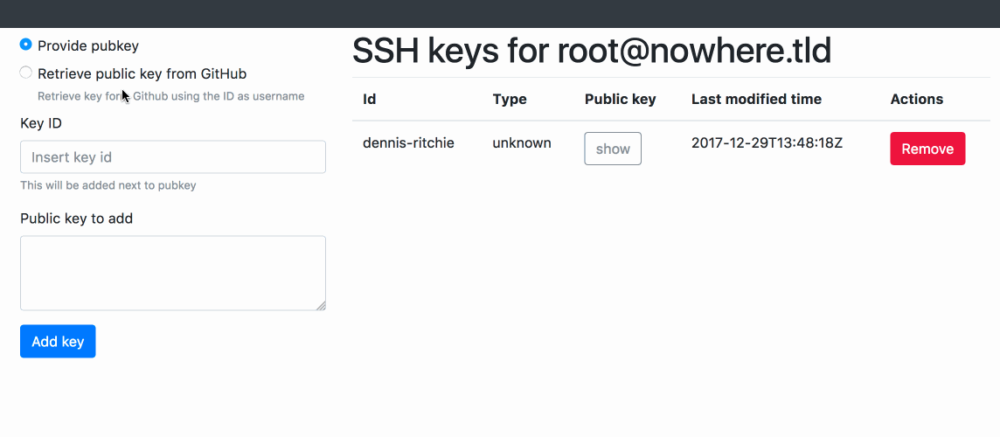

ssh-key-editor
==============

Simple, easy to install and use web based ssh keys editor.

This tools has born to ease the task of managing multiple keys on bastion hosts.

Main features
==============

- retrieve public keys from GitHub

- add a time stamp to keys to see how old they are

See it in action
================



Installation and usage
======================

The easiest way is to use Docker image:

```
$ docker run -d -v /home/<ssh-user>/.ssh:/root/.ssh -p 127.0.0.1:8080:8080 eraclitux/ssh-key-editor
```
The daemon con only be accessed locally for security reasons, to access the web interface with a remote browser
use ssh tunnelling:
```
ssh -v -ND 8081 <user>@<bastion-host>
```
and [configure you browser to use it](https://www.digitalocean.com/community/tutorials/how-to-route-web-traffic-securely-without-a-vpn-using-a-socks-tunnel#step-2-configuring-firefox-to-use-the-tunnel) taking care to direct traffic on tunnel even for `localhost`, visit `http://localhost:8080/` with your browser.

Change default password
-----------------------

To change the default password defined in the Dockerfile just pass a custom one when starting container using `-e HTTP_PASSWORD=<my-passwd>`.

Security considerations
=======================

Misconfiguration of this tool leads to **serious security issues** as unauthorized shell access.
Never bind on public interfaces, if risk can be taken use an http reverse proxy with proper TLS termination to access from the internet otherwise basic auth credentials could be easily sniffed.

Always follow SSH good practices, disable access for `root` and always mount a normal (at most sudoer) user's `.ssh` with `-v`.
